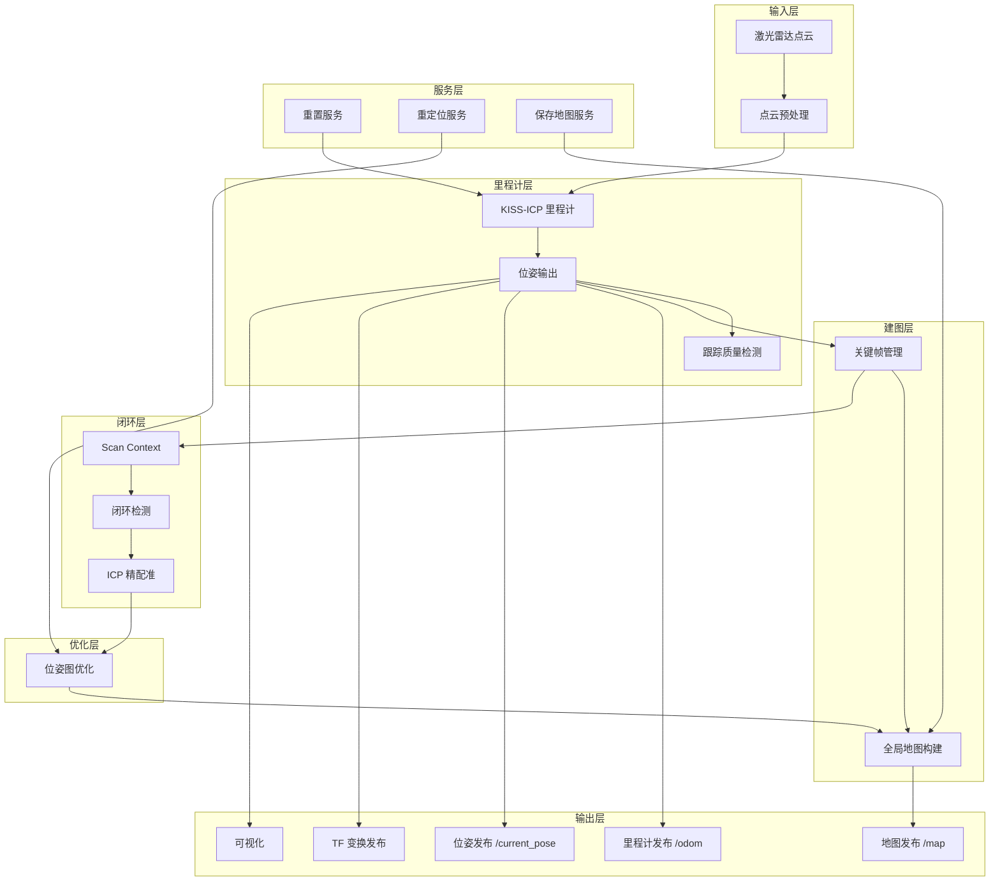

# 系统架构

> 核心系统 - 系统设计、模块关系、数据流

---

## 系统架构概览

LiDAR SLAM2 系统采用多线程架构，主要包含以下核心模块：
- **SlamNode**：主 SLAM 节点，集成里程计、建图和闭环检测
- **KISS-ICP**：点云配准算法
- **Scan Context**：闭环检测算法
- **PoseGraphOptimizer**：位姿图优化
- **Visualizer**：3D 可视化



---

## 核心节点

| 节点名称 | 功能描述 | 主要文件 |
|---------|---------|----------|
| SlamNode | 主 SLAM 节点（集成里程计+建图+闭环） | src/SlamNode.cpp |
| OdometryNode | 里程计节点（独立运行模式） | src/OdometryNode.cpp |
| MappingNode | 地图构建节点（独立运行模式） | src/MappingNode.cpp |
| LoopClosureNode | 闭环检测节点（独立运行模式） | src/LoopClosureNode.cpp |

---

## 核心模块

### 1. SlamNode（主 SLAM 节点）

集成节点，包含以下功能：
- 点云接收与预处理
- KISS-ICP 里程计
- 关键帧管理
- 地图构建
- 闭环检测触发
- 位姿图优化触发
- 数据发布

### 2. LoopClosureDetector（闭环检测）

| 模块名称 | 功能描述 | 主要文件 |
|---------|---------|----------|
| ScanContext | Scan Context 描述子生成与匹配 | src/ScanContext.cpp |
| KeyFrameManager | 关键帧管理 | src/KeyFrameManager.cpp |
| refinePose | ICP 精配准 | src/LoopClosureDetector.cpp |

### 3. PoseGraphOptimizer（位姿图优化）

基于 g2o 的位姿图优化：
- 添加关键帧顶点
- 添加里程计边
- 添加闭环边
- 执行非线性优化
- 更新关键帧位姿

---

## 数据流

### 点云处理流程

1. **点云接收**：从 ROS 话题接收原始点云数据
2. **点云预处理**：
   - 距离过滤：去除太远和太近的点
   - 离群点过滤：使用半径搜索移除离群点
3. **KISS-ICP 匹配**：
   - 构建目标点云的体素哈希地图
   - 执行帧间匹配，估计位姿
4. **跟踪质量监控**：
   - 计算内点率、平均距离、模型偏差
   - 判断是否跟踪丢失
5. **关键帧管理**：
   - 判断是否需要添加关键帧
   - 添加关键帧到闭环检测
   - 添加关键帧到地图
6. **闭环检测**（间隔触发）：
   - 生成 Scan Context 描述子
   - 与历史关键帧匹配
   - ICP 精配准
   - 添加到位姿图优化
7. **位姿图优化**：
   - 优化所有关键帧位姿
   - 更新关键帧位姿
   - 重新拼接全局点云
8. **数据发布**：
   - 发布里程计
   - 发布位姿
   - 发布地图
   - 发布 TF

---

## 坐标系说明

系统使用以下坐标系：

| 坐标系 | 说明 |
|-------|------|
| `rslidar` | 激光雷达坐标系 |
| `base_link` | 机器人基座坐标系 |
| `odom` | 里程计坐标系 |

**TF 树结构**：
```
rslidar (静态外参) → base_link (机器人移动) → odom
```

**静态 TF**（在 launch 文件中发布）：
- `rslidar → base_link`：雷达到机器人本体的外参变换

**动态 TF**（由节点发布）：
- `odom → base_link`：里程计位姿

---

## 话题接口

### 订阅

| 话题名称 | 消息类型 | 功能描述 |
|---------|---------|----------|
| `/points_raw` | sensor_msgs/PointCloud2 | 原始点云数据输入 |

### 发布

| 话题名称 | 消息类型 | 功能描述 |
|---------|---------|----------|
| `/odom` | nav_msgs/Odometry | 里程计数据 |
| `/current_pose` | geometry_msgs/PoseStamped | 当前位姿 |
| `/map` | sensor_msgs/PointCloud2 | 全局地图点云 |
| `/current_cloud` | sensor_msgs/PointCloud2 | 当前帧点云（地图坐标系） |
| `/tf` | tf2_msgs/TFMessage | 坐标变换信息 |

## 服务接口

| 服务名称 | 服务类型 | 功能描述 |
|---------|---------|----------|
| `~/reset` | std_srvs/Empty | 重置 SLAM 系统 |
| `~/set_pose` | std_srvs/Empty | 设置当前位姿 |
| `~/relocalize` | std_srvs/Empty | 触发重定位 |
| `~/save_map` | lidar_slam2_msgs/SaveMap | 保存地图 |

---

## 关键帧管理

### 关键帧判断条件

系统根据以下条件判断是否添加关键帧：
- **平移阈值**：累积移动超过 `translation_threshold` 米
- **旋转阈值**：累积旋转超过 `rotation_threshold` 度
- **时间阈值**：距离上一个关键帧超过 `time_threshold` 秒

### 关键帧数据结构

```cpp
struct KeyFrame {
    uint64_t id_;                    // 关键帧 ID
    ros::Time stamp_;                // 时间戳
    Sophus::SE3d pose_;              // 位姿
    pcl::PointCloud<pcl::PointXYZ>::Ptr cloud_;  // 点云
    Eigen::MatrixXd scan_context_;   // Scan Context 描述子
};
```

---

## 闭环检测流程

1. **Scan Context 生成**：为当前关键帧生成 Scan Context 描述子
2. **相似度匹配**：与历史关键帧的 Scan Context 进行匹配
3. **候选筛选**：选择相似度超过阈值的关键帧作为候选
4. **ICP 精配准**：使用 ICP 进一步验证匹配结果
5. **一致性检查**：检查闭环位姿与里程计位姿的一致性
6. **添加到优化**：将闭环约束添加到位姿图

---

## 位姿图优化

### 图结构

- **顶点**：每个关键帧的位姿
- **边**：
  - 里程计边：相邻关键帧之间的相对位姿
  - 闭环边：检测到闭环的关键帧之间的相对位姿

### 优化算法

- 使用 g2o 库的 Levenberg-Marquardt 优化
- 鲁棒核函数：Huber 核函数减少错误闭环的影响
- 优化参数：迭代次数可配置

---

## 性能特性

### 多线程架构优势

1. 并行处理：不同模块在独立线程中运行
2. 实时响应：不影响核心算法的实时性能
3. 资源隔离：一个模块的异常不会影响其他模块

### 计算复杂度

- 点云预处理：O(n)，其中 n 是点云数量
- KISS-ICP 配准：O(n log n)
- Scan Context 匹配：O(k)，k 是关键帧数量
- 位姿图优化：O(v^3)，v 是关键帧数量（稀疏优化）

### 内存使用

- 点云存储：取决于点云密度和地图大小
- 体素哈希地图：高效的空间数据结构
- 关键帧存储：与关键帧数量成正比

---

## 系统扩展

### 潜在扩展方向

1. 传感器融合：集成 IMU 数据提高定位精度
2. 多雷达支持：支持多个激光雷达
3. 动态物体过滤：提高在动态环境中的鲁棒性
4. 语义分割：结合深度学习进行场景理解
5. 多机器人协同：支持多机器人同时建图

---

## 设计理念

1. **简洁高效**：采用 KISS (Keep It Simple, Stupid) 原则
2. **实时性能**：优先考虑实时性
3. **可扩展性**：模块化设计，便于功能扩展
4. **鲁棒性**：添加异常处理和边界情况检查
5. **可维护性**：清晰的代码结构和文档

---

**下一步建议**: 阅读 [配置参数详解.md](configuration.md) 了解如何优化系统参数
